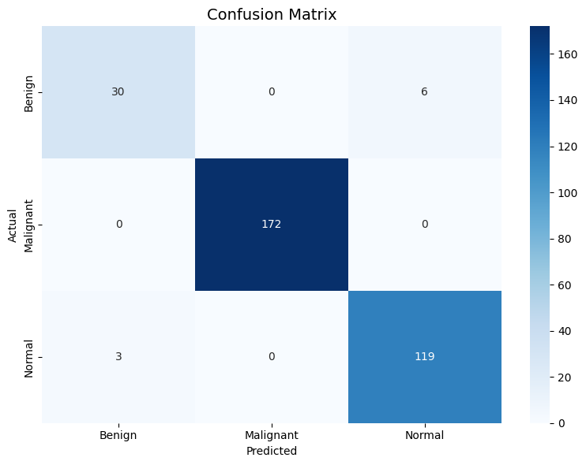
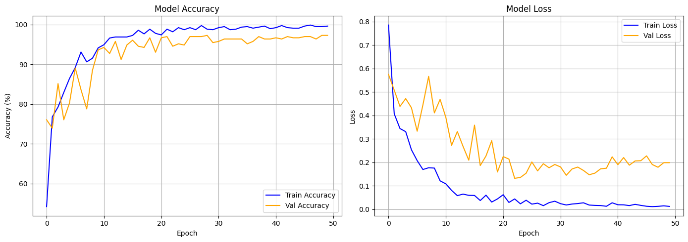
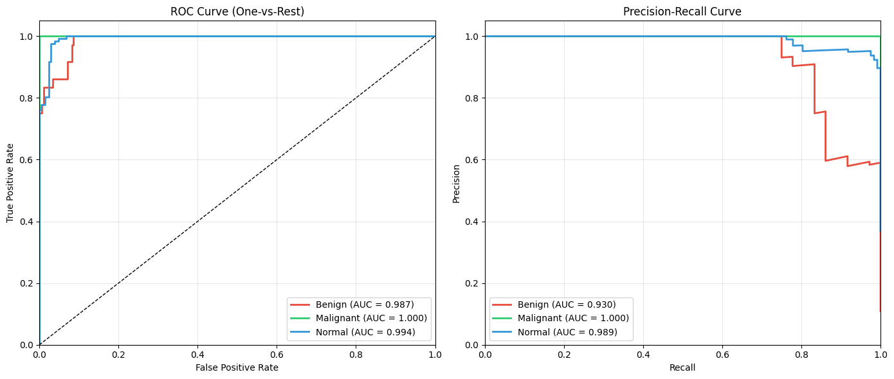

# Lung Cancer Detection with Deep Learning

A deep-learning pipeline that classifies chest CT scan images into **Benign**, **Malignant**, and **Normal** cases using transfer learning with a ResNet-18 convolutional neural network. The model reaches **97.27% validation accuracy**, outperforming the AlexNet baseline (93.55%) reported in the reference literature.

> By **Oussama Samer**

---

## Overview

This project tackles automated lung cancer screening from CT scans as a 3-class image classification problem. It fine-tunes an ImageNet-pretrained **ResNet-18** on the IQ-OTH/NCCD lung cancer dataset, handling significant class imbalance with weighted sampling and a weighted loss function, and evaluates performance with confusion matrices, ROC/PR curves, and per-class metrics.

## Dataset

The dataset contains **1,097 CT scan images** across three classes:

| Class      | Images | Notes                          |
|------------|--------|--------------------------------|
| Benign     | 120    | Minority class                 |
| Normal     | 416    | Healthy tissue                 |
| Malignant  | 561    | Largest class                  |

- **Split:** 70% train / 30% validation (767 / 330 images), seeded for reproducibility.
- **Class imbalance** is addressed with a `WeightedRandomSampler` and class-weighted `CrossEntropyLoss`.

> The notebook expects the raw dataset as `lung_cancer.zip` containing `Bengin cases/`, `Normal cases/`, and `Malignant cases/` folders (e.g. the [IQ-OTH/NCCD Lung Cancer Dataset](https://www.kaggle.com/datasets/adityamahimkar/iqothnccd-lung-cancer-dataset)).

## Model & Approach

- **Architecture:** ResNet-18 pretrained on ImageNet, final fully-connected layer replaced with `Dropout(0.5) → Linear(512, 3)`.
- **Parameters:** ~11.2M (all trainable / full fine-tuning).
- **Input:** RGB images resized to 224×224, normalized with ImageNet statistics.
- **Data augmentation (train):** random horizontal/vertical flips, ±15° rotation, color jitter (brightness & contrast).
- **Optimizer:** Adam (`lr=1e-4`, `weight_decay=1e-4`).
- **Scheduler:** StepLR (step size 10, gamma 0.5).
- **Loss:** Weighted `CrossEntropyLoss` to counter class imbalance.
- **Training:** 50 epochs, batch size 32, best model checkpointed on validation accuracy.

## Results

**Validation accuracy: 97.27%** (best epoch)

| Metric    | AlexNet (Paper) | This Model (ResNet-18) |
|-----------|-----------------|------------------------|
| Accuracy  | 93.548%         | **97.273%**            |

### Per-class metrics

| Class      | Precision | Recall | F1-score | Support |
|------------|-----------|--------|----------|---------|
| Benign     | 0.91      | 0.83   | 0.87     | 36      |
| Malignant  | 1.00      | 1.00   | 1.00     | 172     |
| Normal     | 0.95      | 0.98   | 0.96     | 122     |
| **Accuracy** |         |        | **0.97** | 330     |

### ROC-AUC scores

| Class      | ROC-AUC |
|------------|---------|
| Benign     | 0.9874  |
| Malignant  | 1.0000  |
| Normal     | 0.9939  |

### Visualizations

| Confusion Matrix | Training Curves | ROC / PR Curves |
|------------------|-----------------|-----------------|
|  |  |  |

## Repository Structure

```
lung-cancer-detection/
├── lung_cancer_cnn.ipynb              # Main notebook: data prep, training, evaluation
├── lung Cancer Detection Article.docx # Written article / report
├── export.ris                         # Bibliographic references
├── index.html                         # Simple landing page linking all artifacts
├── confusion_matrix.png               # Confusion matrix on validation set
├── training_curves.png                # Accuracy & loss over epochs
├── roc_pr_curves.png                  # ROC and Precision-Recall curves
└── README.md
```

## Getting Started

The notebook was developed in **Google Colab** (GPU: Tesla T4, PyTorch 2.10 + CUDA).

1. **Open the notebook** — upload `lung_cancer_cnn.ipynb` to [Google Colab](https://colab.research.google.com/) (or run locally with Jupyter and a CUDA-capable GPU).
2. **Provide the data** — when prompted in the first cell, upload `lung_cancer.zip` containing the three class folders.
3. **Run all cells** — the notebook will extract the data, train the model for 50 epochs, and generate all evaluation plots.

### Dependencies

```bash
pip install torch torchvision numpy matplotlib seaborn scikit-learn
```

| Library                  | Purpose                              |
|--------------------------|--------------------------------------|
| `torch`, `torchvision`   | Model, training, transforms          |
| `numpy`                  | Numerical operations                 |
| `matplotlib`, `seaborn`  | Plots & confusion matrix             |
| `scikit-learn`           | Metrics, ROC/PR curves               |

## License

No license specified. Contact the author before reuse.

## Acknowledgments

- IQ-OTH/NCCD Lung Cancer Dataset.
- See `export.ris` and the accompanying article for full references.
